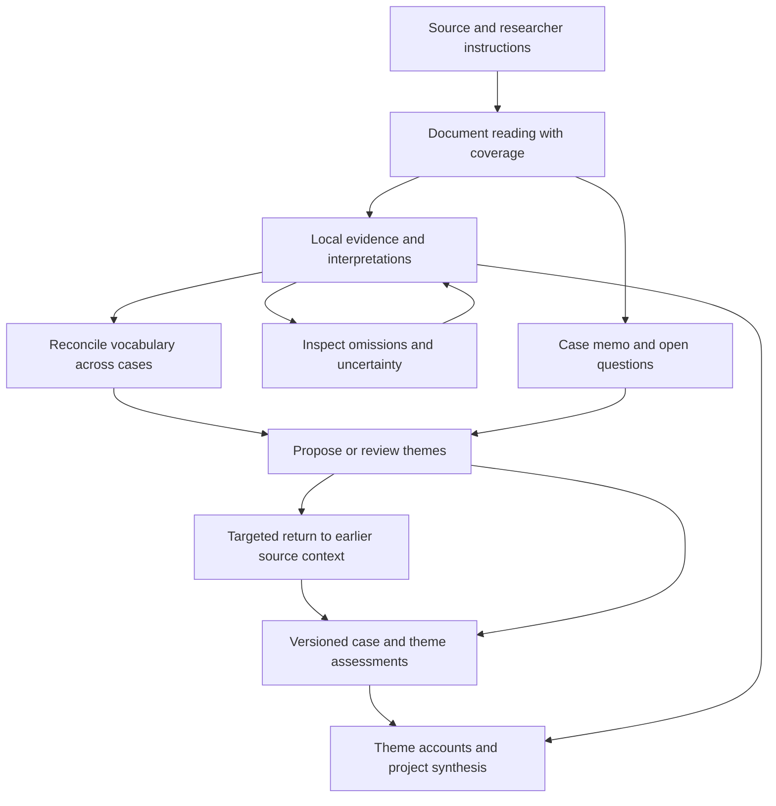

# Astra review — fixing Aperture’s analysis workflow

**Date:** 5 September 2026  
**Baseline:** `92ed7960577754cb07baa56fe97bbbb9a2761e5e`  
**Status:** Proposed implementation plan. The fixes and redesign below have not been implemented.  
**Purpose:** Improve analytical reliability, researcher control, and model efficiency while preserving source-grounded interpretation.

Read this with the [detailed audit](/Users/roman/Desktop/20_Research-Projects/aperture/docs/audits/2026-09-05-llm-and-method-audit.md) and its [offline diagnostic probes](/Users/roman/Desktop/20_Research-Projects/aperture/docs/audits/2026-09-05-probes.py). The audit establishes the observed behavior; this document specifies how to change it. It is a review proposal alongside the existing design record, not a silent replacement of that record.

The baseline checkout matched GitHub when audited. Public production health and sign-in were checked, but authenticated production outputs, configuration, and container revision were not established. Historical benchmarks show substantial synthesis cost; they do not establish the savings or quality of this proposed design.

## 1. Direction and priorities

The central change is to maintain a useful reading of each document independently of project themes. Project analysis should compare and interpret that evidence, with targeted returns to source material when a question requires them.

Preserve the app’s useful foundations: stable source references, mechanical quote matching, inspectable research material beside claims, background jobs, explicit researcher feedback, and the distinction between provisional and frozen themes. Repair their state contracts before extending them.

| Priority | Outcome | Why it comes first |
|---|---|---|
| P0 | Corrections reach the model; completed reassessments replace old results; unknown evidence remains unknown | An economical answer that ignores a correction or misstates its evidence is still a bad research instrument |
| P1 | Dependencies, call costs, and resumable work are recorded accurately | Optimization requires reliable state and measurements |
| P2 | Durable local evidence, case memos, and explicit comparison across cases | This addresses repeated full-document theme searches |
| P3 | Research interfaces, model tuning, retrieval, and extended capabilities | These should build on a trustworthy analytical record |

Success means less redundant model work **with important observations, counterexamples, and interpretive depth preserved**. More codes, fewer themes, or shorter output are not success criteria by themselves.

## 2. Product and methodological decisions

Offer two understandable starting choices, with a short explanation of what each changes:

- **Explore the material:** initial reading receives the source, its structure, and researcher-authored focus and instructions. Generated project themes and the existing codebook do not prescribe this first reading. Later comparison can reconcile vocabulary and revisit earlier evidence.
- **Apply a framework:** initial reading receives a researcher-selected framework version. It records supporting evidence, contrary evidence, ambiguity, and potentially useful material outside that framework. New ideas remain available as proposals.

A researcher can move between these activities deliberately. Do not infer their methodological choice from their research question. Existing projects should retain their current workflow until a new analysis branch or an explicitly chosen reassessment is created; changing the default must not silently reinterpret an existing corpus.

Separate routine automatic work from analytical decisions. Source extraction, quote binding, linking evidence, and updating a summary against an unchanged question can run automatically. Proposed changes to a theme’s meaning should be visible as proposals. An exploratory draft can continue using a clearly labeled provisional theme version; approval is required to label that version researcher-approved, not to permit all further exploration.

Keep operational counts distinct from research conclusions. “Observed in two files,” “supported in two researcher-defined cases,” and “approved as a theme” are different statements. Definition stability is bookkeeping, not a saturation judgment. The methodological rationale and sources are in the audit’s qualitative-method section.

## 3. P0 work packages: repair analytical trust

Each package should land as a focused change with desired-behavior tests. The existing diagnostic probes assert the old defects; convert them into regression tests that assert the corrected behavior rather than treating a failing probe as a new application failure.

### AR-01 — Carry feedback into the work it is meant to change

**Touchpoints:** `jobs._account`, `jobs._accounts`, `account.run`, the ACCOUNT template, feedback assembly/consumption, and `rerun.plan`.

Implement one explicit feedback payload carrying the original text, target, feedback ID, and instruction type. Distinguish a one-time rewrite request from a standing analytical decision. Record exactly which IDs were included in each call. Acknowledgment means “this validated result was produced with this instruction supplied”; it must not falsely certify that a model understood or correctly followed it.

A theme-account comment should reach that account and trigger an update of the project synthesis that depends on it. A project comment should reach PROJECT. Rewrite individual accounts only when the comment explicitly concerns their interpretation or requires evidence below the project level; ambiguous scope can be shown as a proposed action, rather than reflexively rewriting every account.

Standing decisions remain active until explicitly superseded. A failed request must not consume feedback. A skipped, cached, or no-op step must not claim to have applied a previously unseen instruction.

**Acceptance:** a distinctive feedback string is present in the intended prompt; absent from unrelated document coding; linked to the result; still pending after a model or validation failure. A theme correction updates or marks stale the project synthesis, and a later rerun retains standing decisions.

### AR-02 — Replace analysis atomically, including empty results

**Touchpoints:** `read.run`, `store.clear_hits`, `synth._thread_kept`, `store.save_codes`, `store.save_moments`, and summary/follow storage.

Use the sequence **snapshot inputs → call model → validate proposed output → activate result in a short transaction**. Never delete current hits before the model responds. Never hold a database write transaction open during a network request.

For THREAD, a completed, valid response with no supporting evidence must supersede the previous active assessment and claims. A valid response containing one or two sound observations should preserve them as sparse evidence. Neither result is a transport failure. A malformed response, missing required result field, cancelled request, or failed verification cannot masquerade as a successful empty assessment.

Make result activation include its related claims, support judgments, follow outcome, and summaries that describe those claims. Retain prior versions for inspection. In the short-term patch, perform the necessary writes on one connection under one transaction; remove helper-level commits from that transaction’s path. Broader immutable revisions can follow in P1/P2.

**Acceptance:** provider failure preserves existing hits and links; successful empty reassessment removes old evidence from current views; partial failure never mixes half a new assessment with half an old one; a valid sparse observation survives; retrying activation does not duplicate evidence.

### AR-03 — Give examination scope an explicit state

**Touchpoints:** `follow`, `store.followed`, `account._absent_block`, theme/material context, and exports.

Represent examination status separately from evidence outcome. For example, `not_assessed / partial / complete / failed` describes coverage, while `support / contradiction / mixed / inconclusive / no_support_located` describes the result. Evidence can exist after partial coverage; complete coverage need not imply a definitive interpretation.

Missing historical rows map to `not_assessed`, never to “looked for.” Preserve `skipped` as a reason for non-assessment. Legacy `thin` only establishes that the old system discarded a line; it does not establish absence. Show this limitation rather than inventing a more precise historical verdict.

Every new assessment records document/source version, theme version, scope, and the passages or source intervals actually included. “Not applicable” requires an explicit contextual judgment and rationale.

**Acceptance:** a newly uploaded unread file and an older file never reviewed for a new theme both show non-assessment. Partial retrieval cannot yield a complete-source absence label. A failed pass retains its failure/coverage information independently of any older successful assessment.

### AR-04 — Split the three meanings of “check”

**Touchpoints:** CHECK engine/template, routes, feedback routing, and check history.

Create distinct actions:

1. **Verify this claim:** supply the claim, original source span, relevant speaker/question context, and additional context when requested by the verifier.
2. **Search this question:** search source material regardless of whether its passages have already been cited.
3. **Explore unused material:** retain the existing residual search with an accurate label and scope.

Store the question and scope with every result. Separate supporting, contradicting, and merely relevant passages; a quote bearing on a question does not automatically answer it. An empty retrieval result should say no evidence was located within that search, not that the corpus contains no instance. A requested comprehensive scan must cover the full specified source set or report incomplete coverage.

**Acceptance:** the union-membership example in the probes retrieves the already-cited answer; claim verification examines its own evidence; cited and uncited relevant passages both appear in general search; result labels remain accurate after source or question revisions.

### AR-05 — Make verification complete and carry qualifications upward

**Touchpoints:** VERIFY, VERIFY-SUMMARY, thread summaries, ACCOUNT/PROJECT builders, support fields, and rendered citations.

Persist an explicit verification result for each requested item. Missing or malformed verdicts remain unchecked; retry the missing subset within a bounded policy. Never clear an existing qualification simply because a later reply omitted that item.

Add `needs_context` so an insufficient excerpt does not force a false rejection or approval. Expand to the full turn, section, or relevant case context when justified. Distinguish descriptive factual assertions from interpretive propositions, and record the rationale for interpretations. The model can assist evaluation; it cannot declare a researcher’s interpretation objectively final.

Pass `partly`, `unchecked`, and other qualifications into every downstream evidence packet. Rebuild a thread summary after its evidence changes. Verify that a claim fits its theme separately from verifying that the source supports the claim. For ACCOUNT and PROJECT, validate evidence references and scope; contested semantic judgments should remain inspectable rather than silently remove valid interpretive alternatives.

If a citation is no longer current, mark the dependent statement stale or regenerate it. Do not merely remove the citation and leave the prose looking authoritative. Preserve a link to the historical evidence for review.

**Acceptance:** omitted verdicts never become support; partly supported claims remain qualified in accounts and project synthesis; removing a claim invalidates its summary; a theme-fit failure does not erase a valid local observation; a valid broader interpretation can request more context.

### AR-06 — Repair candidate, single-case, and account-budget behavior

**Touchpoints:** `_marked_here`, `promote_by_recurrence`, THEMES lifecycle handling, project evidence assembly, ACCOUNT sampling, and stability display.

An empty code mapping is missing indexing information, not positive evidence that every document carries a candidate. Keep an explicit researcher request to examine a concept as a separate reason to schedule work. Preserve candidate observations even if they never become project themes.

Supply actual qualified evidence IDs to single-case and candidate-only project synthesis. Project synthesis should remain possible before a cross-case theme account exists. Replace automatic promotion with a proposal or a configurable workflow signal; only committed, completed evidence assessments can contribute to that signal.

Remove the four-claim deletion rule as an evidential threshold. Retain sparse observations and label their scope. Convert theme/candidate count limits into workload or display budgets: if work is deferred, record a continuation and show what remains. Do not force an analytically unjustified merge to fit a numerical theme ceiling.

Immediately fix zero-sized ACCOUNT allocations and impose a budget on the **whole** context, including shared passages and non-assessed cases. Later use representative and contrary evidence selection rather than positional sampling. Distinguish “selected examples” from complete evidence coverage. Rename stability to an accurate pass count, or count distinct assessed cases for a precisely defined theme version.

**Acceptance:** no-code candidates do not automatically scan every source; a one-document project can cite its findings; one important observation survives; an incomplete concurrent run cannot promote a theme; 151 carrying materials do not crash; the context never claims to contain all evidence when it is sampled.

## 4. P1: versioned dependencies and cumulative memory

### AR-07 — Make freshness depend on actual inputs

Add a small explicit manifest to each analytical artifact: source/evidence revisions, theme semantic version, research-focus version, standing-decision versions, coverage/examination revisions, prompt/schema versions, and model/configuration identity. Include only dependencies actually read, but include all of them.

Use that manifest for exact reuse and freshness. A failed refresh can leave the last successful artifact visible with a stale label. A fresh artifact requires matching dependencies; elapsed time or “the last DOC ran after THEMES” is insufficient.

Activation must compare the input snapshot with current versions. If a theme changes while a model call is in flight, save its answer as belonging to the old snapshot and queue only the necessary follow-up; do not publish it as a result against the new theme. Use semantic versions for meaning changes, separate from display-label revisions.

| Change | Invalidate or update | Reuse |
|---|---|---|
| New document | Corpus membership/coverage and affected thematic accounts; project synthesis | Earlier local readings |
| Claim correction or qualification | Dependent thread/case summaries, theme account, project statements | Unrelated claims and themes |
| Theme label only | Current display references; prose references where needed | Evidence and semantic assessments |
| Theme meaning | Assessments and accounts depending on that definition | Raw source and independent local evidence |
| Research focus | Artifacts dependent on the previous focus, visibly flagged | Source extraction; prior analysis as historical interpretation |
| Source removal | Coverage and artifacts using that source | Evidence from retained sources |
| Prompt/model change | Future runs use the new configuration; explicit refresh policy for old runs | Existing results remain tied to their original configuration |

Do not schedule mass reanalysis merely because a deployment changed a prompt. Mark comparability and let the chosen workflow determine the reassessment scope.

**Acceptance:** fingerprint tests cover additions, focus, support, coverage, cross-theme shared evidence, and prompt changes. Thread corrections lead through affected accounts before project synthesis. An in-flight old-version result cannot overwrite a new-version result.

### AR-08 — Replace the overwritten project brief with a question register

Store each question with its originating document/evidence, creator, status, and any answers or decisions. Suggested statuses are open, being examined, provisionally answered, and set aside. Keep the reasons and links when status changes.

DOC writes document questions. After a batch, a project operation reconciles new questions with existing ones. Similar wording may suggest a merge, but distinct questions must not silently disappear. Project memory is assembled from the active register and researcher decisions, with a visible token budget.

**Acceptance:** two parallel documents retain both sets of questions regardless of completion order; answering a question preserves its history; a later batch receives the same project snapshot regardless of worker timing.

### AR-09 — Record and resume individual calls

Add a persistent call/attempt record under the existing job/run hierarchy. Record task purpose, target artifact, input manifest/hash, provider/model/effort, attempt number, request ID when available, start/end time, completion reason, validation outcome, and output artifact references.

Keep separate counters for input, cached input, output, and reasoning tokens when the provider supplies them; unknown is null, not zero. Capture usage locally within each call and aggregate afterward. Persist per-thread/check-batch completion so one failed subcall does not replay every successful subcall in DOC.

Replace the global analytical lock with per-project sequencing and a shared provider concurrency limit. This is sufficient for the current single-process deployment; do not introduce distributed infrastructure without a demonstrated need. If multiple workers/processes are introduced, use database claims/leases or equivalent coordination because in-process locks will no longer be sufficient.

Check cancellation before each wave, batch, retry, and result activation. Apply bounded retry policy and a total job budget; an ongoing streamed response should have a recorded cancellation strategy. Network loss can mean the provider charged for an answer the app never received, so record uncertain attempts rather than promise exactly-once billing.

**Acceptance:** a restart resumes only unfinished subcalls; cancellation prevents subsequent paid calls; one project does not monopolize unrelated projects; call totals aggregate correctly under concurrency; duplicate completion does not duplicate active evidence.

## 5. P2: durable document evidence and case comparison

### AR-10 — Introduce the smallest useful analytical record

Extend the existing SQLite application incrementally. The following are logical records, not a requirement to build a generic workflow engine or a separate service for every noun. Final table boundaries should follow real queries and transaction boundaries.

| Record | Essential information | Why it exists |
|---|---|---|
| Source revision | Material ID, text hash, extraction version, original-file/page mapping when available | Reproduce what was actually analyzed without changing old anchors |
| Case and source link | Researcher-defined case, material or source range, participant/time-point metadata, confirmation state | Separate files from analytical units; represent multiple respondents in one CSV |
| Analysis revision | Source/focus/method versions, call IDs, status, superseded revision | Keep historical readings and atomically choose the current one |
| Evidence item | Stable item ID, source revision, one or more spans, concise observation, local code, producer | Preserve a finding before or without a project theme |
| Interpretation | Evidence IDs, interpretive proposition, rationale, alternatives, researcher review | Keep interpretation distinct from extracted or descriptive evidence |
| Verification | Item/version, verdict, reason, context examined, verifier and run | Make qualifications and uncertainty durable |
| Case memo | Evidence/interpretation references, within-case account, exceptions, questions | Preserve case integrity above isolated quotes |
| Theme version | Stable theme ID, semantic version, label, organizing concept, scope, examples/counterexamples, hold | Evolve a theme without changing what an old assessment meant |
| Theme–evidence association | Theme version, evidence item, relation, rationale, assessment revision | Allow reuse without copying the same observation under multiple theme-owned claims |
| Assessment/coverage | Source or case, theme/query version, examined intervals, completeness and outcome | Distinguish unexamined, ambiguous, supporting, and contrary cases |
| Research decision/question | Original wording, scope, provenance, status, supersession links | Preserve researcher authority and cumulative project memory |
| Artifact dependencies | Output revision and exact input references | Plan targeted updates and explain freshness |

Keep a stable logical identity separate from immutable versions. A code-name match alone cannot establish that two researchers or documents meant the same concept. Reconciliation should preserve local wording, supporting examples, and a mapping rationale. A changed definition creates a new version rather than rewriting earlier occurrences in place.

Store multiple evidence spans where an interpretation rests on an exchange or on a contrast within a case. Keep small display quotes, but resolve them to complete source context. Source material containing imperative text must remain data; prompt boundaries should make clear that only researcher instructions configure the task.

**Acceptance:** renaming or removing a theme cannot erase a document’s evidence; one observation can support two distinct interpretations without being counted as two independent source occurrences; every displayed finding resolves to its source version; multiple source files can belong to one case and a CSV can contain multiple cases.

### AR-11 — Replace exhaustive theme-by-document generation with focused work

Use this proposed flow:

**First document pass.** Analyze a complete short source in one call when it fits the budget. For long sources, chunk at meaningful turns/sections, retain sufficient overlap and speaker context, and store precisely which source intervals each chunk covers. Output local evidence items, provisional interpretations, and questions. Follow with case-level integration when needed; an arbitrary chunk boundary must not become a thematic boundary.

**Omission pass.** Examine less-used regions, ambiguous passages, and tensions. Its goal is to challenge the first reading’s omissions, not force every sentence to receive a code. Allow “no additional relevant observation” and distinguish inspected coverage from semantic completeness.

**Vocabulary reconciliation.** Compare local codes with relevant project definitions and source examples. Propose reuse, narrower/wider relations, splits, or distinct concepts. Preserve local code identity even when a project-level mapping is accepted. Start with existing SQL and lexical retrieval; introduce embeddings only if evaluation shows that they improve recall enough to justify complexity and data routing.

**Theme development.** Supply evidence from relevant cases and their memos, including contradictions, sparse observations, and alternatives. Ask for a change proposal with a rationale, not a rewritten complete theme set on every document. Each proposed theme should state its organizing concept, evidential scope, boundaries, supporting instances, contrary instances, and unresolved questions.

**Targeted retrospective review.** A changed theme identifies which earlier evidence may need reevaluation. Retrieval prioritizes relevant spans and then expands context. It must also include a route for finding unindexed evidence: lexical/semantic source search, deliberately sampled residual regions, or a complete source revisit when coverage or conceptual novelty warrants it. A retrieval miss alone cannot justify an absence conclusion.

**Synthesis.** Build a bounded evidence packet that includes representative support, strongest contrary evidence, qualifications, and case scope. Use direct evidence references, with source access when needed. A purely recursive summary-of-summaries chain risks permanently losing the detail selected out at earlier levels.

Initial model-call targets should be stated per operation and measured, rather than committing to an unsupported savings percentage. Some difficult cases should justifiably cost more than the current workflow. The desired reduction is in repeated routine work, with a visible reason for deeper analysis.

## 6. Prompt-by-prompt change specification

Maintain explicit input/output schemas and a compiler test for each active stage. Keep examples method-neutral or deliberately matched to the selected mode; worked examples must obey the rules they illustrate. Distinguish structural validation failures from legitimate empty findings.

| Current prompt | Near-term correction | Target role |
|---|---|---|
| FRAME | Carry sampled-source scope and uncertainty; avoid stating inferred metadata as verified | Bounded structural description supported by extraction and source context |
| DIARIZE | Propagate estimated speaker status into all subsequent prompts; preserve unassigned stretches | Conditional structure assistance, with researcher corrections retained |
| ANGLES | Remove findings from examples; label influence from earlier themes | Optional post-reading exploration or explicit framework sensitization |
| READ | Atomic replacement; expose omissions and output-limit continuations; preserve sparse evidence | Local evidence generation; exploratory mode excludes generated project conclusions |
| THEMES | Treat empty mappings and count limits honestly; version changes and membership; avoid automatic certification | Cross-case theme proposals over source-grounded evidence packets |
| THREAD | Keep sparse results; replace old empty assessments; qualify evidence; separate theme-fit checks | Focused case–theme assessment when needed, with reused evidence and expandable context |
| VERIFY | Require a verdict for each requested item; retain unchecked and needs-context outcomes | Factual warrant assessment with context and explicit limitations |
| DOC | Separate source description from analysis; generate summary from current verified/qualified evidence; write local questions | Independent case memo and synthesis, useful without project themes |
| VERIFY-SUMMARY | Supply the metadata and theme definitions referenced by the summary; preserve incomplete verification | Validate claims and scope without treating interpretive alternatives as formatting errors |
| ACCOUNT | Add feedback and qualifications; repair total budget; protect contrary evidence | Theme argument across cases, with transparent evidence selection |
| PROJECT | Supply actual evidence IDs, including candidate/local evidence; detect stale dependencies | Provisional project argument with clear scope, divergence, and unresolved questions |
| CHECK | Separate claim verification, general search, and residual exploration | Researcher-directed inquiry with recorded search coverage |

For comparison operations, a useful output contract contains: the question/theme version, evidence references, supporting/contrary/ambiguous relations, an explanation, coverage limitations, requests for more context, and proposed changes. Stable IDs and structured fields should carry provenance; prose should carry interpretation.

For transport, request structured output only after confirming support for the actual provider/model. Always validate application-side. Reserve enough output capacity for the requested result; if the response is truncated, save it as an incomplete attempt and resume deliberately. Avoid asking for an unlimited amount of coding while silently keeping only the first entries returned.

Once content contracts are stable, arrange repeated source context as a stable prefix where provider caching supports it. Measure cached usage and visible versus reasoning output before selecting per-stage model/effort profiles. Exact-result reuse must include analytical dependencies and must not substitute for a researcher-requested independent rereading.

## 7. Migration and delivery sequence

### Small, reviewable releases

| Release | Scope | Exit condition |
|---|---|---|
| R1 | AR-01 feedback, AR-02 atomic replacement, AR-03 truthful examination states | Corrections, empty results, failures, and legacy unknown states behave correctly |
| R2 | AR-04 check scope, AR-05 verification propagation, immediate AR-06 lifecycle/budget defects | General search can find cited evidence; qualifications survive; single-case synthesis works |
| R3 | AR-07 dependencies, AR-08 questions, AR-09 call accounting/resumption | No stale output represented as current; calls and attempts can be traced and resumed |
| R4 | AR-10 evidence records and case memos behind an opt-in workflow | Existing outputs remain inspectable; new local evidence is independent of themes |
| R5 | AR-11 targeted comparison and method selection | Quality/cost comparison meets the evaluation criteria below |
| R6 | Selected interface and model-efficiency improvements | Measured benefit and acceptable researcher experience |

R1/R2 should include basic call tracing where needed for correct feedback and validation behavior; R3 completes the broader accounting. Tests and migrations should ship with their relevant change rather than accumulating at the end.

### Preserve existing research

Before rollout, make a consistent SQLite backup using its backup mechanism or an equivalent snapshot that includes committed WAL data. Verify restoration on a copy. Do not copy only the main database file while it is being written.

Add schema changes before switching read paths. Import existing moments as **legacy theme-conditioned evidence**, retaining original IDs, source pointers, run provenance, and old interpretation. Do not relabel them as independent inductive findings. Existing blank support fields become “verification status unknown” unless a recorded result establishes otherwise.

Legacy missing follow rows remain unassessed. Legacy discarded lines remain historically discarded, not retrospectively “absent.” The overwritten project brief cannot be reconstructed from text that was never retained; import what remains with limited provenance. Create tentative file-to-case links as an explicit convenience and require researcher confirmation before making participant/case-level claims.

Use a workflow version per project or analysis branch. Evaluate the new route on a cloned database or separate analysis branch before changing a researcher’s active record. Preserve a way to reopen the previous analysis. Keep schema rollback separate from switching back to the previous workflow: once new records exist, blindly running an older application against a changed database may be unsafe.

At each migration gate, check source counts/hashes, old anchor resolution, historical exports, active artifact uniqueness, case mapping, and the absence of unintentional model work. Backfill provenance and bookkeeping locally where possible; a migration should not launch paid corpus reanalysis automatically.

Production validation must establish the actual running commit, workflow/configuration, and a representative authenticated run. The earlier public health check is insufficient for this gate. Deployment follows review of the completed change and the project’s release process; this document itself makes no deployment changes.

## 8. Evaluation: quality, cost, and researcher effort

First repair the known correctness defects, then freeze that corrected workflow as the comparison baseline. Comparing a redesign against known broken feedback or state handling would confound architecture with bug fixes.

Run four clearly identified conditions using the same corpus and initial model configuration:

| Condition | Purpose |
|---|---|
| Corrected current workflow | Establish the actual baseline |
| Corrected current workflow with code-hit gating | Quantify the inexpensive but potentially lossy alternative |
| Local evidence plus targeted comparison | Test whether reusable document analysis removes redundant reading |
| Local evidence plus targeted comparison and omission review | Test whether a deliberate additional pass recovers useful missed evidence |

Begin with a small pilot to estimate variance and cost, then choose repetitions and a reviewed spending budget. Repeat runs and shuffle document order and upload batching. Compare themes by meaning and evidence, not exact names. Exact theme equality is not a reasonable quality requirement for interpretive analysis, but unexplained sensitivity to incidental upload order is important evidence.

Include fixtures for: one meaningful sentence; a short survey response; a long interview; one case split over several files; many cases in one CSV; an interview question that changes the meaning of an answer; a late-introduced concept; a negative case; contradictory local interpretations; multilingual material; and interrupted or malformed responses. Synthetic fixtures test mechanics; research corpora and qualified readers test analytical usefulness.

| Dimension | Evidence to inspect |
|---|---|
| Factual grounding | Unsupported additions, hardened hedges, speaker mistakes, source-reference failures |
| Analytical coverage | Important observations and counterexamples recovered or missed; what remained unexamined |
| Within-case integrity | Whether the memo preserves narrative/context rather than fragments it into theme labels |
| Theme quality | Coherence, distinctiveness, scope, useful relations, and treatment of negative cases |
| Researcher authority | Whether corrections changed the intended result; clarity of decisions and alternatives |
| State integrity | Active results agree with dependency versions; empty/failed/incomplete runs are distinguished |
| Efficiency | Actual calls, attempts, input/cache/output/reasoning tokens, elapsed time, and repeat work |
| Usability | Researcher time spent checking, correcting, understanding progress, and preparing an export |

Use blind output review by qualitative researchers, supplemented by model-assisted triage if helpful. Ask reviewers for evidence and consequential omissions rather than a single opaque quality score. Choose acceptance thresholds before unblinding the main comparison. For mechanical properties, the gate is strict: no source corruption, no feedback loss, no unresolved active citation presented as current, and no duplicate activation. For interpretive quality, assess the seriousness of gains and losses with source material open.

Do not select a cheaper model merely because it produces fewer claims. Do not add another verification model unless its incremental benefit is shown. Report provider invoice costs separately from estimates whenever cached input or unknown reasoning usage makes a simple token calculation incomplete.

## 9. Further improvement ideas, ranked

These are proposals, not findings that the current app already supports them. Promote them into implementation only when the prerequisite record and researcher need are clear.

| Idea | Researcher benefit | Prerequisite / first useful version | Priority |
|---|---|---|---|
| **“Why did this change?” view** | See the effect of a comment or new document without rereading the entire output | Compare two artifact versions, their evidence, and the triggering decision | High |
| **Case-by-theme matrix** | Compare cases while distinguishing support, contradiction, mixed evidence, and non-assessment | AR-03/07/10; click a cell to open exact evidence and context | High |
| **Direct manual evidence and coding** | Add or reinterpret a meaningful passage the model missed | Create researcher-authored evidence/interpretation items with the same provenance as model items | High |
| **Negative-case workspace** | Keep exceptions and explanations visible during theme development | A filter/view over contrary and ambiguous associations; no extra generation by default | High |
| **Researcher memos and decision journal** | Preserve standpoint, analytic rationale, and changing questions | Distinguish notes, instructions, decisions, and draft interpretations; link to evidence/theme versions | High |
| **Preview the scope of a rerun** | Understand which documents and summaries will change and the likely work involved | Dependency plan with historical duration/token ranges and explicit uncertainty; no approval screen for every routine step | High |
| **Reliable import preview** | Catch extraction loss before analysis | Show PDF pages/text, include DOCX tables where relevant, and let the researcher confirm CSV ID/question columns; OCR as a separately identified path | High |
| **Complete source context on demand** | Inspect a quote with its question, turn, section, and original page | Multi-span evidence and preserved source mapping; small quotes remain a display convenience | High |
| **Analysis branches** | Explore an alternative question or framework without overwriting an existing interpretation | Reuse source/evidence revisions while keeping decisions and outputs separate | Medium |
| **Method-aware export** | Explain how the analysis was produced and what the researcher changed | Export selected method, evidence coverage, model contribution, decisions, limitations, and source references | Medium |
| **Multilingual analysis controls** | Preserve original wording while choosing the language of analysis | Keep original and translated text distinct; attach translation provenance and uncertainty; avoid silently deleting unexpected-script tokens | Medium |
| **Longitudinal case view** | Compare a participant or organization across time without counting visits as independent cases | Confirmed case/time-point links and contextual memos | Medium |
| **Collaborative interpretation** | Let multiple researchers compare readings and resolve disagreements transparently | Attribute decisions and preserve competing interpretations; do not force agreement as a universal quality target | Medium |
| **Semantic retrieval** | Find relevant but differently worded material when lexical retrieval is insufficient | Evaluate against missed-evidence fixtures; preserve local/provider data boundaries and source-level access controls | Experimental |
| **Adaptive deeper reading** | Spend extra model effort on ambiguity or a consequential contradiction | Explicit uncertainty signals and a bounded expansion policy, validated for bias and missed cases | Experimental |
| **Relationship maps** | Explore links among themes, mechanisms, and cases | Every edge carries evidence, interpretation status, and contrary instances; a map should not imply causality by appearance | Experimental |

For import work, prioritize errors that affect the unit of analysis: tables omitted from Word extraction, scanned PDFs with no text layer, respondent identifiers guessed from short answers, and speaker estimation mistaken for known attribution. Preserve the original upload and record extraction choices before improving the language-model stages above them.

## 10. Implementation map

The existing files are enough to start. New records may justify small dedicated modules, but avoid splitting the application into services as a prerequisite.

| Area | Existing entry points |
|---|---|
| Prompt contracts and transport | [LLM client](/Users/roman/Desktop/20_Research-Projects/aperture/app/llm.py), [READ prompt](/Users/roman/Desktop/20_Research-Projects/aperture/app/prompts/read.md), [ACCOUNT prompt](/Users/roman/Desktop/20_Research-Projects/aperture/app/prompts/account.md) and the other templates in the same directory |
| Local reading and theme interpretation | [READ engine](/Users/roman/Desktop/20_Research-Projects/aperture/app/engine/read.py), [THEMES engine](/Users/roman/Desktop/20_Research-Projects/aperture/app/engine/themes.py), [synthesis](/Users/roman/Desktop/20_Research-Projects/aperture/app/engine/synth.py) |
| Verification and research questions | [VERIFY](/Users/roman/Desktop/20_Research-Projects/aperture/app/engine/verify.py), [VERIFY-SUMMARY](/Users/roman/Desktop/20_Research-Projects/aperture/app/engine/verify_summary.py), [CHECK](/Users/roman/Desktop/20_Research-Projects/aperture/app/engine/check.py) |
| Cross-case synthesis | [ACCOUNT engine](/Users/roman/Desktop/20_Research-Projects/aperture/app/engine/account.py), PROJECT in the synthesis module |
| State, transactions, and migrations | [database](/Users/roman/Desktop/20_Research-Projects/aperture/app/db.py), [store](/Users/roman/Desktop/20_Research-Projects/aperture/app/store.py) |
| Scheduling and feedback | [jobs](/Users/roman/Desktop/20_Research-Projects/aperture/app/jobs.py), [rerun planning](/Users/roman/Desktop/20_Research-Projects/aperture/app/rerun.py), [actions](/Users/roman/Desktop/20_Research-Projects/aperture/app/verbs.py) |
| Researcher-facing state and exports | [context builders](/Users/roman/Desktop/20_Research-Projects/aperture/app/context.py), [theme page](/Users/roman/Desktop/20_Research-Projects/aperture/app/templates/theme.html), [record page](/Users/roman/Desktop/20_Research-Projects/aperture/app/templates/record.html) |
| Source extraction | [intake](/Users/roman/Desktop/20_Research-Projects/aperture/app/intake.py), [ingest](/Users/roman/Desktop/20_Research-Projects/aperture/app/ingest.py), [anchor matching](/Users/roman/Desktop/20_Research-Projects/aperture/app/anchor.py) |
| Evaluation | [evaluation runner](/Users/roman/Desktop/20_Research-Projects/aperture/scripts/eval_run.py), [metrics](/Users/roman/Desktop/20_Research-Projects/aperture/scripts/eval_metrics.py), [evaluation record](/Users/roman/Desktop/20_Research-Projects/aperture/docs/EVAL.md) |

The next implementable slice is **R1**. Its completion should produce trustworthy feedback handling, replacement semantics, and examination labels before any claim that Aperture has become cheaper or methodologically stronger. The architectural hypothesis is then tested by R4/R5, with the improved baseline, source evidence, and reviewer judgments kept available for comparison.
